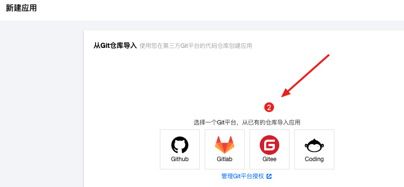
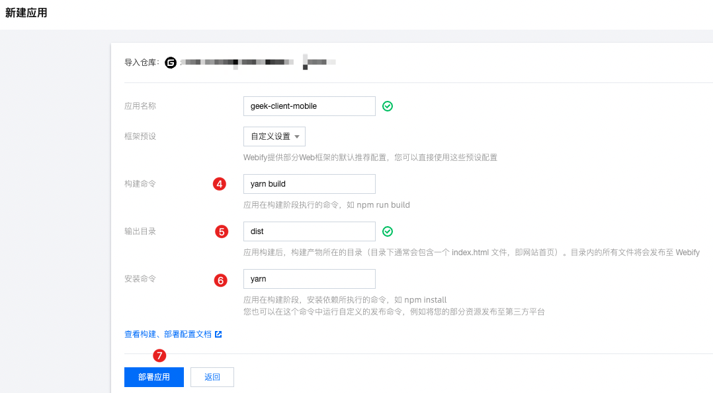
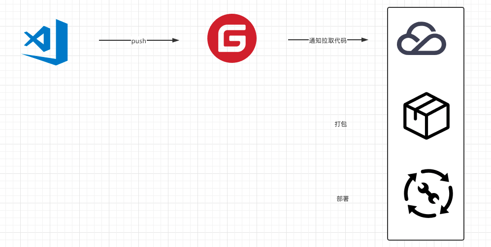

# 项目部署

## 项目部署-pm2部署

> 目标：了解使用pm2部署项目

介绍：pm2是node.js进程管理工具，提供node.js应用管理，如自动重载、性能监控、负载均衡等

1）本地打包=》得到 dist 资源包

```sh
pnpm build
```


2）上传服务器

服务器一般是 linux系统，使用 XFTP 进行文件的上传和下载（这个就不赘述了）


3）服务器使用pm2进行部署（本地演示） [托管静态资源](https://pm2.keymetrics.io/docs/usage/expose/)

全局安装：

```sh
npm i pm2 -g
```

进入dist：

```sh
# pm2 serve 目录 端口  --name 服务名称
pm2 serve ./ 8080 --name my-cp-server
```


4）history路由模式问题，如果有子路径，刷新页面 404 

原因：hostory 改变路由是前端切换，不会请求服务器，一旦刷新浏览器 `/consult/dep`按照这个地址请求服务器，是没有对应的资源的。

解决：遇见子路径且没有后缀名，服务器定位到 ‘index.html’ 页面返回给前端即可。

命令：

```sh
pm2 serve --spa ./ 8080 --name my-cp-server
```


pm2其他命令：

```sh
# 查看服务列表
pm2 list
# 删除服务
pm2 delete my-cp-server
```

## 项目部署-环境变量

> 目标：了解环境变量，在项目部署中的使用

文档：[vite环境变量](https://cn.vitejs.dev/guide/env-and-mode.html)

场景：

1. 开发环境和生产环境，使用不同支付回跳地址
2. 开发环境和生产环境，使用不同api请求地址

步骤：

1. 执行`pnpm dev`对应`.env.development`文件

   ```ts
   # VITE_APP_变量名 = 值 （必须大写）
   # 本地开发支付回跳地址
   VITE_APP_CALLBACK=http://localhost:5173
   ```

2. 执行`pnpm build`对应`.env.production`文件

   ```ts
   # 线上支付回跳地址
   VITE_APP_CALLBACK=https://xxx.com
   ```

3. js中使用

   ```js
   console.log('环境变量：', import.meta.env)
   ```

   

## 自动部署-腾讯云部署

> 目标：了解项目自动化部署流程

[腾讯云-Web应用托管](https://console.cloud.tencent.com/webify/index)

- 注册，实名认证，才可以使用 webify 服务
- <span style="color:red">vite项目部署因为服务器环境问题失败</span>（vue-cli项目ok）


使用步骤演示：

1）创建应用


2）关联码云，需要码云授权



3）选择需要使用的仓库


4）构建配置




5）进行构建


6）尝试访问


自动部署流程：




# 第十二天

