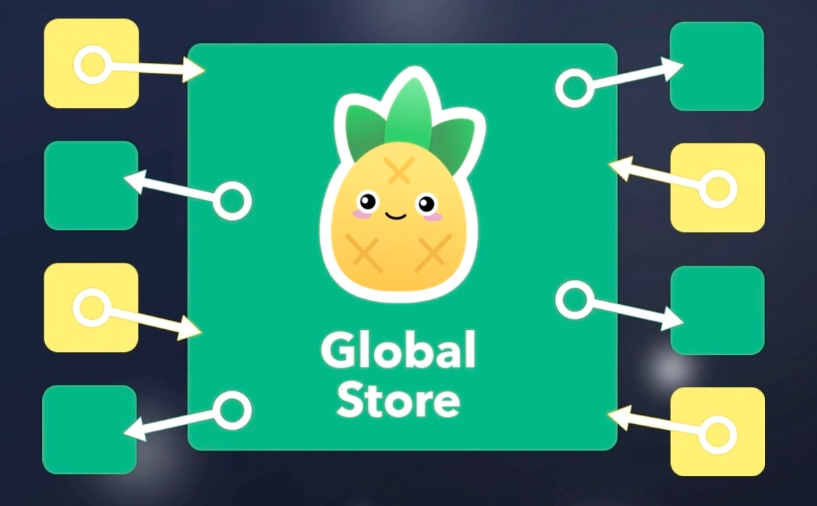

# Pinia 核心


## Pinia 介绍{#intro}


[What is Pinia](https://pinia.vuejs.org/zh/index.html) ?

- `Pinia` 是一个状态管理工具，它和 `Vuex` 一样为 `Vue` 应用程序提供共享状态管理能力。
- 语法和 `Vue3` 一样，它实现状态管理有两种语法：`选项式API` 与  `组合式API`，我们学习组合式API语法。
- 它也支持 `Vue2` 也支持 `devtools`，当然它也是类型安全的，支持 `TypeScript`


Why should I use Pinia?

- Pinia的数据流转图



- 可以创建多个全局仓库，不用像 Vuex 一个仓库嵌套模块，结构复杂。
- 管理数据简单，提供数据和修改数据的逻辑即可，不像Vuex需要记忆太多的API。


小结：

- Pinia 是一个简单实用的状态管理工具，和菠萝一样 `香`


## Pinia 15分钟上手{#start}

> 掌握：实用Pinia使用，管理计数器的状态

使用步骤：

- 安装

```bash
yarn add pinia
# or
npm i pinia
```

- 导入，实例化，当做插件使用，和其他插件使用套路相同

```typescript{2,5,8}
import { createApp } from 'vue'
import { createPinia } from 'pinia'
import App from './App.vue'

const pinia = createPinia()
const app = createApp(App)

app.use(pinia)
app.mount('#app')
```

- 创建仓库&使用仓库

```js
import { defineStore } from "pinia"
import { computed, ref } from "vue"

export const useCounterStore = defineStore("counter", () => {
  return {}
})
```

```vue
<script setup lang="ts">
import { useCounterStore } from "./store/counter"
// store中有状态和函数
const store = useCounterStore()
</script>
```

- 进行状态管理

```typescript
  // state
  const count = ref(100)
  // getters
  const doubleCount = computed(() => count.value * 2)
  // mutations
  const update = () => count.value++
  // actions
  const asyncUpdate = () => {
    setTimeout(() => {
      count.value++
    }, 1000)
  }
  return { count, doubleCount, update, asyncUpdate }
```

```vue
<template>
  APP {{ store.count }} {{ store.doubleCount }}
  <button @click="store.update()">count++</button>
  <button @click="store.asyncUpdate()">async update</button>
</template>
```


总结：

- 通过 `const useXxxStore = defineStore('id',函数)` 创建仓库得到使用仓库的函数

| Vuex                 | Pinia                               |
| -------------------- | ----------------------------------- |
| state                | `ref` 和 `reactive`创建的响应式数据 |
| getter               | `computed` 创建的计算属性           |
| mutations 和 actions | 普通函数，同步异步均可              |

- 使用Pinia与在组件中维护数据大体相同，这就是 `Pinia` 的状态管理基本使用


## storeToRefs的使用 {#store-to-refs}

> 掌握：使用 storeToRefs 解决解构仓库状态丢失响应式的问题

问题：

- 当我们想解构 store 提供的数据时候，发现数据是没有响应式的。

回忆：

- 在学习 vue 组合式API创建的响应式数据的时候，使用 `toRefs` 保持结构后数据的响应式

方案：

- 使用 `storeToRefs` 解决解构仓库状态丢失响应式的问题

代码：

```ts
import { storeToRefs } from 'pinia'

const store = useCounterStore()
const { count, doubleCount } = storeToRefs(store)
```

小结：

- 当你想从 store 中解构对应的状态使用，需要使用 `storeToRefs`


## 使用 Pinia 改造头条(作业){#case}

> 掌握：使用 Pinia 维护头条需要共享的数据 当前频道ID

步骤：

- 安装 `pinia` 和使用 `pinia` 插件
- 创建 channel 仓库，提供频道ID数据和修改频道函数
- 去除组件之间通讯的代码，在组件中使用store完成业务


代码：

- 安装 `pinia` 和使用 `pinia` 插件

```ts{4,7,10}
import { createApp } from 'vue';
import './styles/index.css'
// 1. 导入创建pinia的函数
import { createPinia } from 'pinia'
import App from './App.vue';
// 2. 创建pinia插件实例
const pinia = createPinia()
const app = createApp(App)
// 3. 使用插件
app.use(pinia)

app.mount('#app');
```

- 创建 channel 仓库，提供频道ID数据和修改频道函数

`store/channel.ts`

```ts
import { defineStore } from "pinia";
import { ref } from "vue";

export const useChannelStore = defineStore('channel', () => {
  const channelId = ref(0)
  const changeChannel = (id: number) => {
    channelId.value = id
  }
  return { channelId, changeChannel }
})
```

- 修改组件逻辑

`App.vue`

```vue
<script setup lang="ts">
import ChannelNav from './components/ChannelNav.vue';
import ArticleList from './components/ArticleList.vue'
</script>

<template>
  <ChannelNav />
  <ArticleList />
</template>
```

`ChannelNav.vue`

```diff
<script setup lang="ts">
import axios from 'axios';
import { onMounted, ref } from 'vue';
+import { useChannelStore } from '../store/channel';
import { ChannelItem, ChannelResData } from '../types/data';

// 1. 获取频道数据
const channels = ref<ChannelItem[]>([]);
onMounted(async () => {
  const res = await axios.get<ChannelResData>(
    'http://geek.itheima.net/v1_0/channels',
  );
  channels.value = res.data.data.channels;
});

// 2.完成切换效果
+const store = useChannelStore();
</script>

<template>
  <div class="channel-nav">
    <nav class="list">
      <a
        class="item"
+        :class="{ active: store.channelId === item.id }"
        href="javascript:;"
        v-for="item in channels"
        :key="item.id"
+        @click="store.changeChannel(item.id)"
      >
        {{ item.name }}
      </a>
    </nav>
  </div>
</template>

```

`ArticleList.vue`

```diff
<script setup lang="ts">
import axios from 'axios';
import { ref, watch } from 'vue';
+import { useChannelStore } from '../store/channel';
import { ArticleItem, ArticleResData } from '../types/data';

+const store = useChannelStore()

const articles = ref<ArticleItem[]>([]);
watch(
+  () => store.channelId,
  async () => {
    const res = await axios.get<ArticleResData>(
      `http://geek.itheima.net/v1_0/articles`,
      {
        params: {
          channel_id: store.channelId,
          timestamp: Date.now(),
        },
      },
    );
    articles.value = res.data.data.results;
  },
  { immediate: true }
);
</script>
```


# 第三天